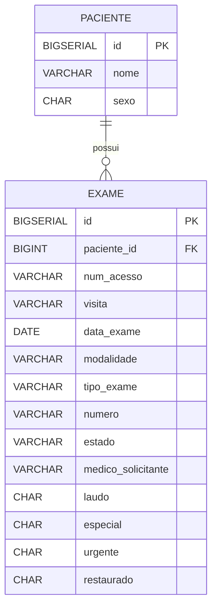

# 🏥 Sistema de Gestão de Pacientes e Exames

Sistema web desenvolvido em **Java 8**, utilizando **Servlets e JDBC**, para gerenciamento de pacientes e seus exames médicos.

---

## 🚀 Tecnologias Utilizadas

- **Linguagem:** Java 8  
- **Servidor de Aplicação:** Apache Tomcat  
- Java Servlets  
- JSP  
- JDBC  
- HTML5 + CSS3 + Bootstrap  
- Banco de Dados Relacional  PostgreSQL

---

## 🏗 Arquitetura

O projeto segue uma organização em camadas:

controller/ → Servlets (camada de entrada)
service/ → Regras de negócio
dao/ → Acesso ao banco via JDBC
model/ → Entidades do sistema
webapp/ → JSP, HTML e arquivos estáticos


### 🔄 Fluxo da Requisição
Cliente → Servlet → Service → DAO → Banco de Dados

---

## 📋 Funcionalidades (em desenvolvimento)
- ✅ Listagem de pacientes

---

## 🗄 Modelagem do Banco de Dados

### 📌 Diagrama ER 


## 🚀 Executando o Projeto via WAR (Release)

Este projeto disponibiliza o arquivo `.war` pronto para execução na seção **Releases** do repositório.

---

## 📥 1. Baixar o arquivo WAR

1. Acesse a aba **Releases** do projeto no GitHub.
2. Clique na versão mais recente.
3. Na seção **Assets**, baixe o arquivo `.war`.

---

## 🖥️ 2. Instalar o Apache Tomcat 9

Este projeto foi desenvolvido para rodar no **Apache Tomcat 9**.

### Passos:

1. Baixe o Tomcat 9 no site oficial:
   https://tomcat.apache.org/download-90.cgi

2. Extraia o arquivo em uma pasta de sua preferência.

3. Configure a variável de ambiente `JAVA_HOME` apontando para um **JDK 8**.

   ⚠️ Importante: `JAVA_HOME` deve apontar para o diretório do JDK, não para a pasta `bin`.

   Exemplo correto no Windows:

### 📂 3. Fazer Deploy do WAR

1. Copie o arquivo `.war` baixado.
2. Cole dentro da pasta: C:\Program Files\Java\jdk1.8.0_xxx
4. Inicie o servidor:

- Windows:
  ```
  bin\startup.bat
  ```

- Linux / Mac:
  ```
  ./bin/startup.sh
  ```

Se tudo estiver correto, o servidor iniciará em:


http://localhost:8080


---

## 📂 3. Fazer Deploy do WAR

1. Copie o arquivo `.war` baixado.
2. Cole dentro da pasta:


TOMCAT_HOME/webapps/


3. Aguarde alguns segundos.
4. O Tomcat irá descompactar automaticamente o projeto.

---

## 🌐 4. Acessar a Aplicação

No navegador, acesse:

http://localhost:8080/medlab/


O nome do contexto será o mesmo nome do arquivo `.war`.

---

## ✅ Verificação

Se tudo estiver configurado corretamente:

- O Tomcat iniciará sem erros no console
- A aplicação será descompactada na pasta `webapps`
- O sistema carregará normalmente no navegador
